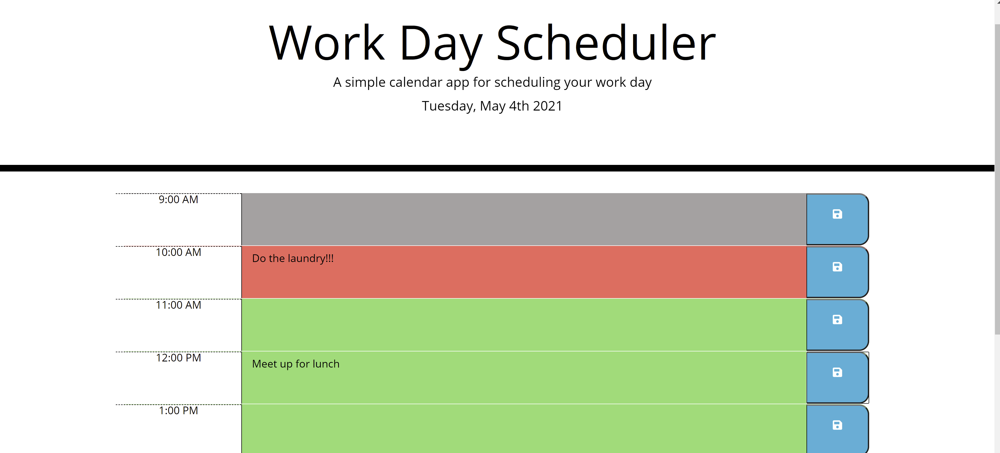

# <hourly_calendar>

## Description
My motivation for creating this project was to get more familiar with JQuery, and also to start thinking more abstractly about loops. In this project I needed to loop over elements in the HTML, rather than simply looping through an array, in order to dynamically apply classes to specific HTML elements. These classes are added based on the current time of day. When I have more time, I'll revisit and eliminate the repetition in my code by dynamically creating the HTML elements using JS, and using loops to save to local storage and display saved info. This will greatly simplify the code and look much cleaner. The application in it's current state is completely functional and will be helpful for anyone needing an hourly planner.

## Installation
This is a link to the repo on Github, which can be cloned. https://github.com/bwalters8910/hourly_calendar

This is a link to the deployed application. https://bwalters8910.github.io/hourly_calendar/

## Usage
To use, simply type into the text box area and click the save button to the right in order to save that text to your local storage. You can then navigate away from the page and return and your task will still be displayed. To remove a task, delete the text and click the save button again.

## License
© 2021 Trilogy Education Services, LLC, a 2U, Inc. brand. Confidential and Proprietary. All Rights Reserved.